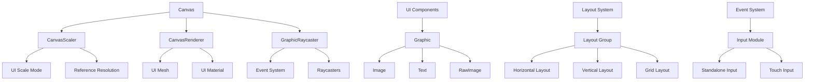
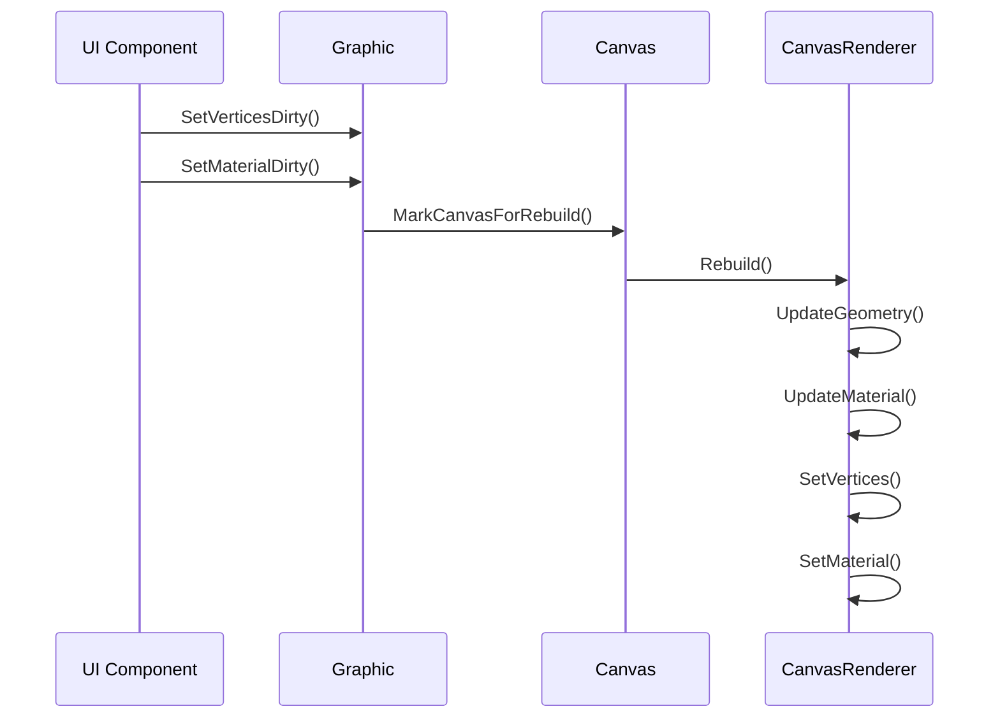
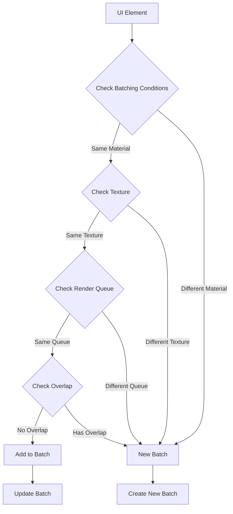
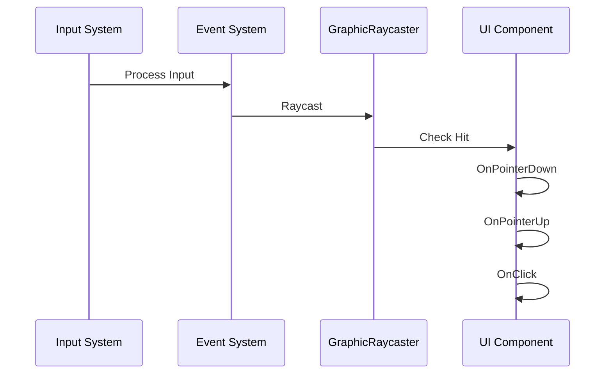
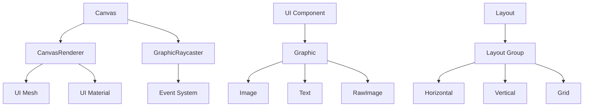

# UGUI 架构与原理

## 1. 整体架构图

## 2. 重建（Rebuild）时序图

## 3. 合批（Batching）流程图

## 4. 事件系统时序图

## 5. 关键组件关系

## 6. 性能优化关键点

1. **重建优化**：
   - 避免频繁修改 UI 属性
   - 使用对象池
   - 合理使用 Layout
   - 减少嵌套层级

2. **合批优化**：
   - 相同材质和纹理
   - 避免重叠
   - 合理组织层级
   - 使用 Canvas Group

3. **事件优化**：
   - 减少事件监听器
   - 及时移除事件监听
   - 使用事件池
   - 避免频繁触发事件 