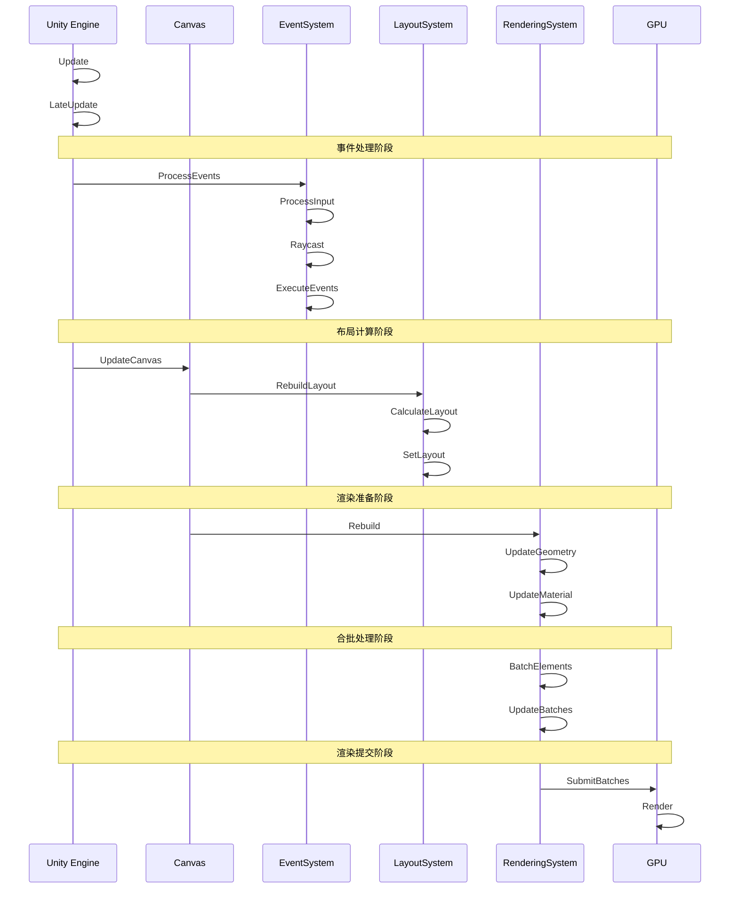
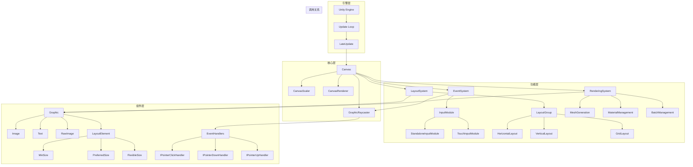

# UGUI 完整系统架构

## 1. 完整系统架构图

```mermaid
graph TD
    subgraph Unity Engine
        A[Unity Engine] --> B[Update Loop]
        B --> C[LateUpdate]
    end
    
    subgraph UGUI Core
        C --> D[Canvas]
        D --> E[CanvasScaler]
        D --> F[CanvasRenderer]
        D --> G[GraphicRaycaster]
    end
    
    subgraph Event System
        H[EventSystem] --> I[InputModule]
        I --> J[StandaloneInputModule]
        I --> K[TouchInputModule]
        
        L[GraphicRaycaster] --> M[Raycasters]
        M --> N[PhysicsRaycaster]
        M --> O[Physics2DRaycaster]
        
        P[EventHandlers] --> Q[IPointerClickHandler]
        P --> R[IPointerDownHandler]
        P --> S[IPointerUpHandler]
        P --> T[IDragHandler]
        P --> U[IScrollHandler]
    end
    
    subgraph Layout System
        V[LayoutSystem] --> W[LayoutGroup]
        W --> X[HorizontalLayoutGroup]
        W --> Y[VerticalLayoutGroup]
        W --> Z[GridLayoutGroup]
        
        AA[LayoutElement] --> AB[MinSize]
        AA --> AC[PreferredSize]
        AA --> AD[FlexibleSize]
        
        AE[LayoutRebuilder] --> AF[CalculateLayout]
        AE --> AG[SetLayout]
    end
    
    subgraph Rendering System
        AH[CanvasRenderer] --> AI[MeshGeneration]
        AH --> AJ[MaterialManagement]
        AH --> AK[BatchManagement]
        
        AL[Graphic] --> AM[Image]
        AL --> AN[Text]
        AL --> AO[RawImage]
        
        AP[BatchSystem] --> AQ[BatchElements]
        AP --> AR[UpdateBatches]
        AP --> AS[SubmitBatches]
    end
    
    subgraph System Interactions
        D --> H
        D --> V
        D --> AH
        
        H --> L
        L --> P
        
        V --> AE
        AE --> AL
        
        AH --> AP
    end
```

## 2. 完整时序图

## 3. 系统调用关系

## 4. 系统说明

### 4.1 引擎层
- **Unity Engine**：Unity 引擎核心
- **Update Loop**：Unity 更新循环
- **LateUpdate**：Unity 后期更新

### 4.2 核心层
- **Canvas**：UI 系统的根节点
- **CanvasScaler**：处理 UI 缩放
- **CanvasRenderer**：处理 UI 渲染
- **GraphicRaycaster**：处理 UI 射线检测

### 4.3 功能层
- **EventSystem**：处理 UI 事件
- **LayoutSystem**：处理 UI 布局
- **RenderingSystem**：处理 UI 渲染

### 4.4 组件层
- **Graphic**：UI 元素基类
- **LayoutElement**：布局元素
- **EventHandlers**：事件处理器

## 5. 关键流程说明

### 5.1 事件处理流程
1. Unity 引擎触发 Update
2. EventSystem 处理输入事件
3. GraphicRaycaster 进行射线检测
4. 执行对应的事件处理器

### 5.2 布局计算流程
1. Canvas 触发布局重建
2. LayoutSystem 计算布局
3. 更新 UI 元素位置和大小
4. 标记需要重建的 UI 元素

### 5.3 渲染处理流程
1. Canvas 触发渲染重建
2. 更新 UI 元素的几何数据
3. 更新 UI 元素的材质数据
4. 执行合批处理
5. 提交渲染数据到 GPU

### 5.4 系统交互流程
1. 事件系统触发 UI 元素变化
2. 布局系统计算新的布局
3. 渲染系统更新 UI 显示
4. 合批系统优化渲染性能 