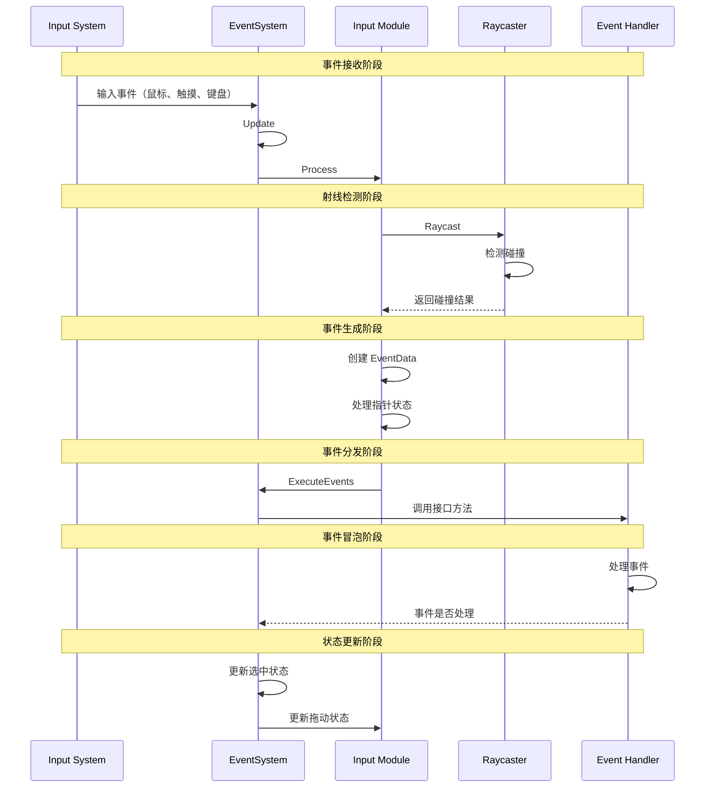
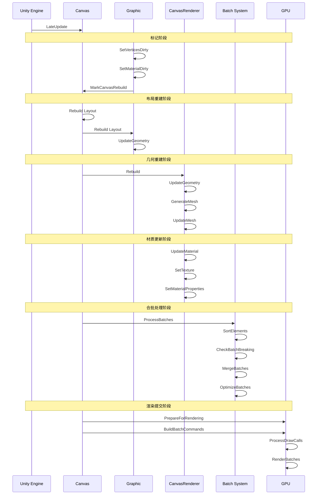

# UGUI 完整系统文档

## 1. 系统概述

UGUI（Unity GUI）是 Unity 引擎的官方 UI 系统，它提供了一套完整的 UI 解决方案，包括渲染、布局、事件处理等功能。本文档详细说明了 UGUI 的架构、原理和实现细节，特别关注事件系统和渲染系统的工作机制。

## 2. 完整系统架构

### 2.1 整体架构图

```mermaid
graph TD
    %% 引擎层
    subgraph Unity Engine
        A[Unity Engine] --> B[Main Loop]
        B --> B1[Start/Initialize]
        B --> B2[Update]
        B --> B3[FixedUpdate]
        B --> B4[LateUpdate]
        B --> B5[OnGUI]
        B --> B6[Render]
    end
    
    %% UGUI 核心层
    subgraph UGUI Core
        C[Canvas] --> D[CanvasScaler]
        C --> E[CanvasRenderer]
        C --> F[GraphicRaycaster]
        C --> C1[Canvas Group]
        C --> C2[World/Screen Space]
        C --> C3[Sort Order]
        
        D --> D1[Scale Mode]
        D --> D2[Reference Resolution]
        D --> D3[Match Mode]
        
        E --> E1[Mesh Generator]
        E --> E2[Material Manager]
        E --> E3[Batch Handler]
        
        F --> F1[Raycast Method]
        F --> F2[Block Events]
        F --> F3[Ignore Reversed Graphics]
    end
    
    %% 事件系统
    subgraph Event System
        G[EventSystem] --> H[Input Module]
        G --> G1[Event Processing]
        G --> G2[Event Execution]
        G --> G3[Selected Object]
        
        H --> I[Standalone Input Module]
        H --> J[Touch Input Module]
        H --> H1[Input Settings]
        H --> H2[Input Handlers]
        
        K[Raycasters] --> L[Graphic Raycaster]
        K --> M[Physics Raycaster]
        K --> N[Physics2D Raycaster]
        K --> K1[Camera]
        K --> K2[Event Mask]
        
        O[Event Handlers] --> P[IPointerClickHandler]
        O --> Q[IPointerDownHandler]
        O --> R[IPointerUpHandler]
        O --> S[IDragHandler]
        O --> T[IDropHandler]
        O --> U[IScrollHandler]
        O --> V[IBeginDragHandler]
        O --> W[IEndDragHandler]
        O --> X[IMoveHandler]
        O --> Y[ISubmitHandler]
        O --> Z[ICancelHandler]
        O --> O1[ISelectHandler]
        O --> O2[IDeselectHandler]
        
        AA[Event Data] --> AB[BaseEventData]
        AA --> AC[PointerEventData]
        AA --> AD[AxisEventData]
        AA --> AA1[Position]
        AA --> AA2[Delta]
        AA --> AA3[Pressure]
    end
    
    %% 布局系统
    subgraph Layout System
        AE[Layout System] --> AF[Layout Group]
        AE --> AE1[Layout Rebuilder]
        AE --> AE2[Layout Utility]
        AE --> AE3[Auto Layout]
        
        AF --> AG[Horizontal Layout Group]
        AF --> AH[Vertical Layout Group]
        AF --> AI[Grid Layout Group]
        AF --> AF1[Padding]
        AF --> AF2[Spacing]
        AF --> AF3[Child Alignment]
        AF --> AF4[Control Child Size]
        
        AJ[Layout Element] --> AK[Min Size]
        AJ --> AL[Preferred Size]
        AJ --> AM[Flexible Size]
        AJ --> AJ1[Layout Priority]
        AJ --> AJ2[Ignore Layout]
    end
    
    %% 渲染系统
    subgraph Rendering System
        AN[Rendering Pipeline] --> AO[Vertex Generation]
        AN --> AP[Material Management]
        AN --> AQ[Batch Processing]
        AN --> AR[Draw Call Optimization]
        AN --> AN1[Occlusion Culling]
        AN --> AN2[Render Target]
        
        AS[Graphic] --> AT[Image]
        AS --> AU[Text]
        AS --> AV[RawImage]
        AS --> AS1[MaskableGraphic]
        AS --> AS2[Vertex Data]
        AS --> AS3[Material Properties]
        
        AW[Canvas Renderer] --> AX[Mesh Generation]
        AW --> AY[Material Management]
        AW --> AZ[Batch Management]
        AW --> AW1[Vertex Colors]
        AW --> AW2[UV Mapping]
        AW --> AW3[Transform Matrix]
        
        BA[Batch System] --> BB[Batch Creation]
        BA --> BC[Batch Merging]
        BA --> BD[Batch Breaking]
        BA --> BE[Batch Submission]
        BA --> BA1[Texture Atlas]
        BA --> BA2[Material Property Blocks]
        BA --> BA3[Dynamic Batching]
    end
    
    %% 特效系统
    subgraph Effect System
        BF[UI Effects] --> BG[Shadow]
        BF --> BH[Outline]
        BF --> BI[Position as UV1]
        BF --> BJ[Mask]
        BF --> BK[RectMask2D]
        BF --> BF1[Effect Material]
        BF --> BF2[Effect Texture]
    end
    
    %% 系统交互
    subgraph System Interactions
        %% 引擎到核心系统
        B4 --> C
        B4 --> G
        
        %% 核心系统交互
        C --> G
        C --> AE
        C --> AN
        
        %% 事件系统内部
        G --> K
        K --> O
        
        %% 布局系统内部
        AE --> AS
        AJ --> AF
        
        %% 渲染系统内部
        AN --> AW
        AW --> AS
        AW --> BA
        
        %% 系统间交互
        G --> AS
        AE --> AS
        AN --> BF
        AS --> AW
    end
```

### 2.2 系统层次

1. **引擎层**
   - Unity Engine：整个 Unity 引擎
   - Main Loop：Unity 的主循环，包含 Start、Update、LateUpdate 等
   - Render Pipeline：Unity 的渲染管线

2. **核心层**
   - Canvas：UI 系统的根节点，管理 UI 元素
   - CanvasScaler：处理 UI 的缩放和适配
   - CanvasRenderer：负责 UI 元素的渲染
   - GraphicRaycaster：处理 UI 元素的射线检测

3. **功能层**
   - EventSystem：处理输入事件和 UI 交互
   - LayoutSystem：管理 UI 元素的布局
   - RenderingSystem：管理 UI 元素的渲染
   - EffectSystem：处理 UI 特效

4. **组件层**
   - Graphic：所有 UI 可视元素的基类
   - LayoutElement：UI 布局元素
   - EventHandlers：UI 事件处理接口
   - UIEffects：UI 特效组件

## 3. 事件系统详解

### 3.1 事件系统架构

```mermaid
graph TD
    %% 事件系统核心
    A[EventSystem] --> B[EventManager]
    A --> C[EventProcessor]
    A --> D[UIModule]
    
    %% 输入模块
    E[Input Module] --> F[Standalone Input Module]
    E --> G[Touch Input Module]
    E --> H[Custom Input Module]
    
    %% 射线检测
    I[Raycasters] --> J[Graphic Raycaster]
    I --> K[Physics Raycaster]
    I --> L[Physics2D Raycaster]
    
    %% 事件数据
    M[Event Data] --> N[BaseEventData]
    N --> O[PointerEventData]
    N --> P[AxisEventData]
    
    %% 事件接口
    Q[Event Interfaces] --> R[IPointerClickHandler]
    Q --> S[IPointerDownHandler]
    Q --> T[IPointerUpHandler]
    Q --> U[IDragHandler]
    Q --> V[IDropHandler]
    Q --> W[IScrollHandler]
    Q --> X[IBeginDragHandler]
    Q --> Y[IEndDragHandler]
    Q --> Z[IMoveHandler]
    Q --> AA[ISelectHandler]
    Q --> AB[IDeselectHandler]
    Q --> AC[ISubmitHandler]
    Q --> AD[ICancelHandler]
    
    %% 事件执行
    AE[ExecuteEvents] --> AF[Execute]
    AE --> AG[ExecuteHierarchy]
    AE --> AH[GetEventHandler]
    
    %% 系统交互
    A --> E
    A --> I
    A --> M
    A --> Q
    A --> AE
```

### 3.2 事件处理时序图

### 3.3 事件系统工作原理

1. **事件接收流程**
   - Unity 引擎捕获输入事件（鼠标、触摸、键盘）
   - EventSystem 在 Update 循环中处理这些事件
   - 通过 InputModule 适配不同的输入设备
   - 生成对应的 EventData

2. **射线检测机制**
   - GraphicRaycaster 发射射线检测 UI 元素
   - 物理射线检测器处理世界空间 UI
   - 根据射线命中结果排序 UI 元素
   - 处理遮挡和层级关系

3. **事件分发流程**
   - ExecuteEvents 处理事件分发逻辑
   - 按层级遍历 UI 元素树
   - 检查每个元素是否实现了事件接口
   - 调用对应的接口方法处理事件

4. **事件冒泡与捕获**
   - 事件首先传递给最深层的子元素
   - 如果子元素不处理，事件冒泡给父元素
   - 可以在事件处理中阻止冒泡
   - 通过 EventTrigger 可扩展事件处理

## 4. 渲染系统详解

### 4.1 渲染系统架构

```mermaid
graph TD
    %% 渲染系统核心
    A[Canvas Rendering] --> B[Canvas]
    A --> C[CanvasRenderer]
    A --> D[Render Pipeline Integration]
    
    %% 几何生成
    E[Geometry Generation] --> F[Vertex Buffer]
    E --> G[Index Buffer]
    E --> H[Mesh Generation]
    E --> I[UV Mapping]
    
    %% 材质管理
    J[Material Management] --> K[Material Property]
    J --> L[Shader Selection]
    J --> M[Texture Management]
    J --> N[Render States]
    
    %% UI元素
    O[UI Elements] --> P[Image]
    O --> Q[Text]
    O --> R[RawImage]
    O --> S[Mask]
    O --> T[RectMask2D]
    
    %% 合批处理
    U[Batch Processing] --> V[Batch Creation]
    U --> W[Batch Merging]
    U --> X[Batch Breaking]
    U --> Y[Dynamic Batching]
    U --> Z[Static Batching]
    
    %% 渲染提交
    AA[Render Submission] --> AB[Command Buffer]
    AA --> AC[Draw Calls]
    AA --> AD[State Changes]
    AA --> AE[GPU Upload]
    
    %% 系统交互
    A --> E
    A --> J
    A --> O
    A --> U
    A --> AA
```

### 4.2 渲染和合批时序图

### 4.3 重建机制

1. **重建触发条件**
   - **布局重建触发**
     - RectTransform 位置/大小改变
     - 子物体添加或删除
     - 父物体布局改变
     - LayoutGroup 属性改变
     - Canvas 缩放或分辨率改变
     - SetLayoutDirty() 被调用

   - **渲染重建触发**
     - Graphic 颜色改变
     - 材质或纹理改变
     - 字体或文本改变
     - 精灵或图片改变
     - Mask 或透明度改变
     - SetVerticesDirty()/SetMaterialDirty() 被调用

2. **重建流程**
   - 标记阶段：标记需要重建的组件
   - 收集阶段：收集所有标记的组件
   - 排序阶段：根据依赖关系排序
   - 执行阶段：执行重建操作
   - 清理阶段：清理标记状态

3. **重建优化**
   - 延迟重建：合并多次重建请求
   - 部分重建：只重建变化的部分
   - 缓存重建：缓存重建结果
   - 异步重建：分帧执行重建

### 4.4 合批机制

1. **合批条件**
   - **必要条件**
     - 相同材质
     - 相同着色器
     - 相同渲染队列
     - 相同纹理
     - 相同渲染状态

   - **优化条件**
     - 无重叠（避免透明度混合问题）
     - 深度连续（避免 Z-fighting）
     - 相同 Canvas Group
     - 同一个 Canvas 下

2. **合批打断因素**
   - 不同材质或着色器
   - 不同纹理或渲染状态
   - UI 元素重叠
   - 使用了 Mask 或 RectMask2D
   - 使用了特殊效果（如阴影、描边）
   - Canvas Group 的 alpha 不为 1
   - 三维空间中的变换不一致

3. **合批流程**
   - 收集阶段：收集所有可渲染元素
   - 排序阶段：根据深度和材质排序
   - 分析阶段：检查合批条件
   - 合并阶段：合并符合条件的元素
   - 优化阶段：优化合批结果
   - 提交阶段：提交到渲染管线

4. **合批优化技术**
   - 材质合并：合并相同属性的材质
   - 纹理图集：使用纹理图集合并纹理
   - 顶点合并：合并相邻元素的顶点
   - 索引优化：优化索引缓冲区
   - 渲染状态缓存：缓存渲染状态

## 5. 性能优化指南

### 5.1 事件系统优化

1. **减少射线检测**
   - 禁用不需要交互的元素的 Raycast Target
   - 合理设置 Graphics Raycaster 的阻挡遮罩
   - 使用 RectMask2D 剪裁不可见区域
   - 优化射线检测的层级结构

2. **事件处理优化**
   - 减少事件监听器数量
   - 及时移除不需要的事件监听
   - 使用事件委托合并处理
   - 避免在事件处理中执行耗时操作

3. **输入处理优化**
   - 自定义 Input Module 处理特定输入
   - 使用输入缓冲减少事件触发频率
   - 实现事件节流和防抖
   - 优化触摸输入处理

### 5.2 渲染系统优化

1. **减少重建**
   - 避免频繁修改 UI 属性
   - 批量更新 UI 元素
   - 使用对象池管理动态 UI 元素
   - 延迟重建处理

2. **优化合批**
   - 使用相同材质和纹理
   - 避免 UI 元素重叠
   - 优化 Canvas 分组
   - 使用纹理图集

3. **减少绘制调用**
   - 合理组织 UI 层级
   - 减少透明度变化
   - 避免使用复杂效果
   - 优化材质属性

4. **内存优化**
   - 释放不需要的资源
   - 使用 Sprite Atlas
   - 压缩纹理
   - 优化网格数据

### 5.3 布局系统优化

1. **优化布局计算**
   - 减少嵌套层级
   - 缓存布局结果
   - 使用固定尺寸替代动态布局
   - 控制布局更新频率

2. **布局组使用建议**
   - 选择合适的布局组件
   - 避免复杂的布局层级
   - 使用 Content Size Fitter 适配内容
   - 合理设置布局元素优先级

## 6. 最佳实践

### 6.1 UI 设计

1. **架构设计**
   - 使用 MVVM 或 MVC 模式
   - 分离 UI 逻辑和业务逻辑
   - 使用 UI 管理器统一管理
   - 模块化 UI 组件

2. **性能考虑**
   - 扁平化 UI 层级
   - 复用 UI 元素
   - 预加载常用 UI
   - 延迟加载不常用 UI

### 6.2 事件处理

1. **事件监听**
   - 合理使用事件接口
   - 实现自定义事件系统
   - 使用事件池优化内存
   - 处理复杂的手势交互

2. **事件传递**
   - 实现自定义事件传递
   - 优化事件冒泡链
   - 控制事件传递范围
   - 处理事件优先级

### 6.3 渲染优化

1. **资源管理**
   - 预加载和卸载资源
   - 使用资源池管理
   - 控制资源生命周期
   - 优化资源加载策略

2. **特效处理**
   - 减少特效使用
   - 优化特效实现
   - 使用着色器替代复杂特效
   - 控制特效更新频率 