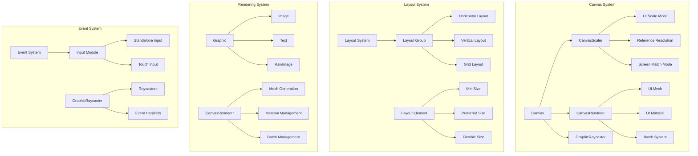
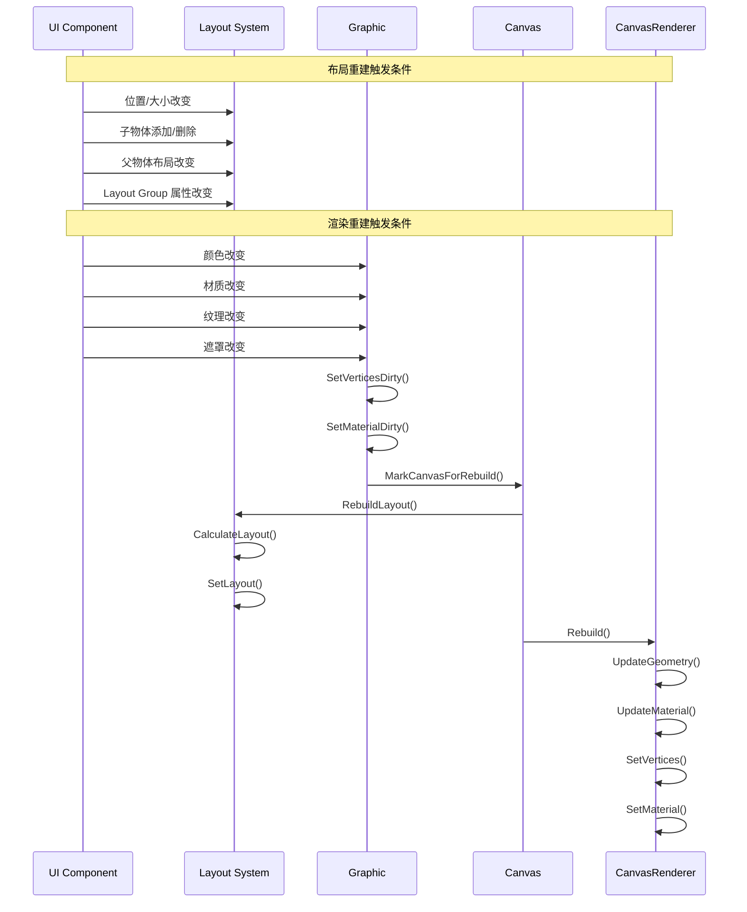
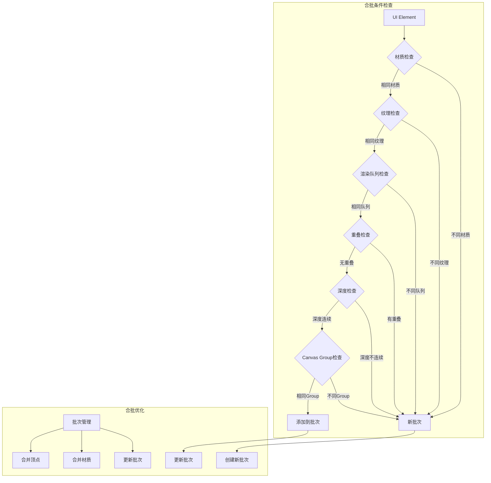

# UGUI 详细架构与原理

## 1. 详细架构图

## 2. 重建（Rebuild）详细时序图

## 3. 合批（Batching）详细流程图

## 4. 影响重建的因素

### 4.1 布局重建触发条件
1. **位置/大小改变**：
   - RectTransform 的 position 改变
   - RectTransform 的 sizeDelta 改变
   - RectTransform 的 anchor 改变
   - RectTransform 的 pivot 改变

2. **层级结构改变**：
   - 子物体添加或删除
   - 父物体改变
   - 兄弟物体顺序改变

3. **布局组件属性改变**：
   - Layout Group 的 padding 改变
   - Layout Group 的 spacing 改变
   - Layout Group 的 alignment 改变
   - Layout Element 的 preferred size 改变

### 4.2 渲染重建触发条件
1. **视觉属性改变**：
   - 颜色（Color）改变
   - 透明度（Alpha）改变
   - 材质（Material）改变
   - 纹理（Texture）改变
   - 遮罩（Mask）改变

2. **几何属性改变**：
   - 形状改变
   - 边框改变
   - 圆角改变
   - 阴影改变

## 5. 影响合批的因素

### 5.1 合批条件
1. **材质条件**：
   - 相同材质
   - 相同着色器
   - 相同渲染队列

2. **纹理条件**：
   - 相同纹理
   - 相同纹理设置
   - 相同纹理过滤模式

3. **空间条件**：
   - 无重叠
   - 深度连续
   - 相同 Canvas Group

### 5.2 合批打断因素
1. **材质相关**：
   - 不同材质
   - 不同着色器
   - 不同渲染队列

2. **纹理相关**：
   - 不同纹理
   - 不同纹理设置
   - 不同纹理过滤模式

3. **空间相关**：
   - UI 元素重叠
   - 深度不连续
   - 不同 Canvas Group

4. **其他因素**：
   - 遮罩使用
   - 特殊效果（如阴影）
   - 动态更新频繁 