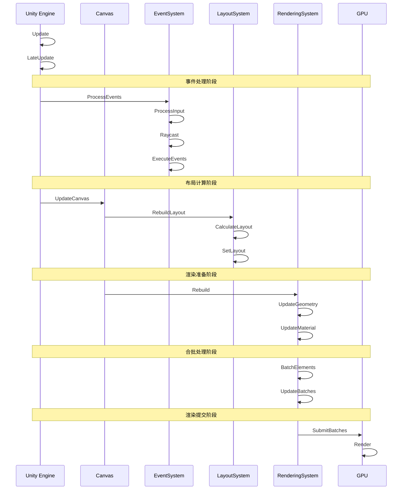

# UGUI 完整系统文档

## 1. 系统概述

UGUI（Unity GUI）是 Unity 引擎的 UI 系统，它提供了一个完整的 UI 解决方案，包括布局、渲染、事件处理等功能。本文档详细说明了 UGUI 的架构、原理和实现细节。

## 2. 系统架构

### 2.1 整体架构

```mermaid
graph TD
    subgraph Unity Engine
        A[Unity Engine] --> B[Update Loop]
        B --> C[LateUpdate]
    end
    
    subgraph UGUI Core
        C --> D[Canvas]
        D --> E[CanvasScaler]
        D --> F[CanvasRenderer]
        D --> G[GraphicRaycaster]
    end
    
    subgraph Event System
        H[EventSystem] --> I[InputModule]
        I --> J[StandaloneInputModule]
        I --> K[TouchInputModule]
        
        L[GraphicRaycaster] --> M[Raycasters]
        M --> N[PhysicsRaycaster]
        M --> O[Physics2DRaycaster]
        
        P[EventHandlers] --> Q[IPointerClickHandler]
        P --> R[IPointerDownHandler]
        P --> S[IPointerUpHandler]
        P --> T[IDragHandler]
        P --> U[IScrollHandler]
    end
    
    subgraph Layout System
        V[LayoutSystem] --> W[LayoutGroup]
        W --> X[HorizontalLayoutGroup]
        W --> Y[VerticalLayoutGroup]
        W --> Z[GridLayoutGroup]
        
        AA[LayoutElement] --> AB[MinSize]
        AA --> AC[PreferredSize]
        AA --> AD[FlexibleSize]
        
        AE[LayoutRebuilder] --> AF[CalculateLayout]
        AE --> AG[SetLayout]
    end
    
    subgraph Rendering System
        AH[CanvasRenderer] --> AI[MeshGeneration]
        AH --> AJ[MaterialManagement]
        AH --> AK[BatchManagement]
        
        AL[Graphic] --> AM[Image]
        AL --> AN[Text]
        AL --> AO[RawImage]
        
        AP[BatchSystem] --> AQ[BatchElements]
        AP --> AR[UpdateBatches]
        AP --> AS[SubmitBatches]
    end
    
    subgraph System Interactions
        D --> H
        D --> V
        D --> AH
        
        H --> L
        L --> P
        
        V --> AE
        AE --> AL
        
        AH --> AP
    end
```

### 2.2 系统层次

1. **引擎层**
   - Unity Engine：Unity 引擎核心
   - Update Loop：Unity 更新循环
   - LateUpdate：Unity 后期更新

2. **核心层**
   - Canvas：UI 系统的根节点
   - CanvasScaler：处理 UI 缩放
   - CanvasRenderer：处理 UI 渲染
   - GraphicRaycaster：处理 UI 射线检测

3. **功能层**
   - EventSystem：处理 UI 事件
   - LayoutSystem：处理 UI 布局
   - RenderingSystem：处理 UI 渲染

4. **组件层**
   - Graphic：UI 元素基类
   - LayoutElement：布局元素
   - EventHandlers：事件处理器

## 3. 系统流程

### 3.1 完整时序图

### 3.2 关键流程说明

1. **事件处理流程**
   - Unity 引擎触发 Update
   - EventSystem 处理输入事件
   - GraphicRaycaster 进行射线检测
   - 执行对应的事件处理器

2. **布局计算流程**
   - Canvas 触发布局重建
   - LayoutSystem 计算布局
   - 更新 UI 元素位置和大小
   - 标记需要重建的 UI 元素

3. **渲染处理流程**
   - Canvas 触发渲染重建
   - 更新 UI 元素的几何数据
   - 更新 UI 元素的材质数据
   - 执行合批处理
   - 提交渲染数据到 GPU

4. **系统交互流程**
   - 事件系统触发 UI 元素变化
   - 布局系统计算新的布局
   - 渲染系统更新 UI 显示
   - 合批系统优化渲染性能

## 4. 重建与合批

### 4.1 重建（Rebuild）机制

1. **触发条件**
   - 布局重建：
     - RectTransform 属性改变
     - 层级结构改变
     - 布局组件属性改变
   - 渲染重建：
     - 视觉属性改变
     - 几何属性改变

2. **重建流程**
   - 标记脏数据
   - 触发布局计算
   - 更新几何数据
   - 更新材质数据
   - 执行重建操作

### 4.2 合批（Batching）机制

1. **合批条件**
   - 材质条件：
     - 相同材质
     - 相同着色器
     - 相同渲染队列
   - 纹理条件：
     - 相同纹理
     - 相同纹理设置
   - 空间条件：
     - 无重叠
     - 深度连续
     - 相同 Canvas Group

2. **合批优化**
   - 静态合批
   - 动态合批
   - 合批打断处理

## 5. 性能优化

### 5.1 重建优化
1. **减少重建**
   - 避免频繁修改 UI 属性
   - 使用对象池
   - 合理使用 Layout
   - 减少嵌套层级

2. **布局优化**
   - 使用 Layout Group 合理组织 UI
   - 避免频繁改变布局
   - 使用 Layout Element 控制大小

### 5.2 合批优化
1. **材质优化**
   - 使用相同材质
   - 使用相同纹理
   - 避免频繁切换材质

2. **空间优化**
   - 避免 UI 元素重叠
   - 保持深度连续
   - 使用 Canvas Group 管理 UI 组

### 5.3 事件优化
1. **事件处理**
   - 减少事件监听器
   - 及时移除事件监听
   - 使用事件池
   - 避免频繁触发事件

2. **射线检测**
   - 优化射线检测范围
   - 使用 Raycast Target 控制
   - 避免不必要的射线检测

## 6. 最佳实践

### 6.1 UI 设计
1. **层级结构**
   - 合理组织 UI 层级
   - 避免过深的嵌套
   - 使用 Canvas Group 管理 UI 组

2. **布局管理**
   - 使用 Layout Group 自动布局
   - 合理设置 Layout Element
   - 避免频繁改变布局

### 6.2 性能优化
1. **渲染优化**
   - 使用合批
   - 避免重叠
   - 使用 Canvas Group

2. **内存优化**
   - 使用对象池
   - 及时释放资源
   - 避免内存泄漏

### 6.3 代码优化
1. **事件处理**
   - 使用事件池
   - 及时移除监听
   - 避免频繁触发

2. **UI 更新**
   - 批量更新
   - 延迟更新
   - 避免频繁重建 