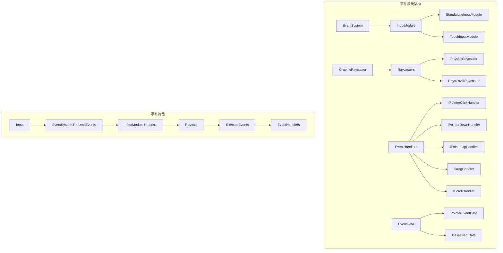
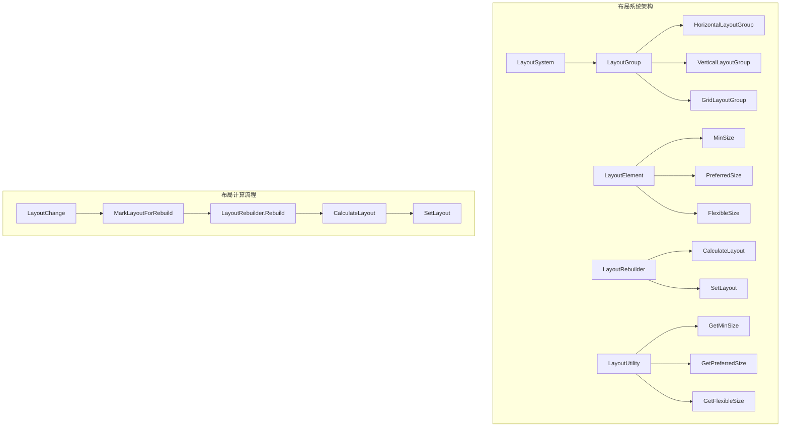
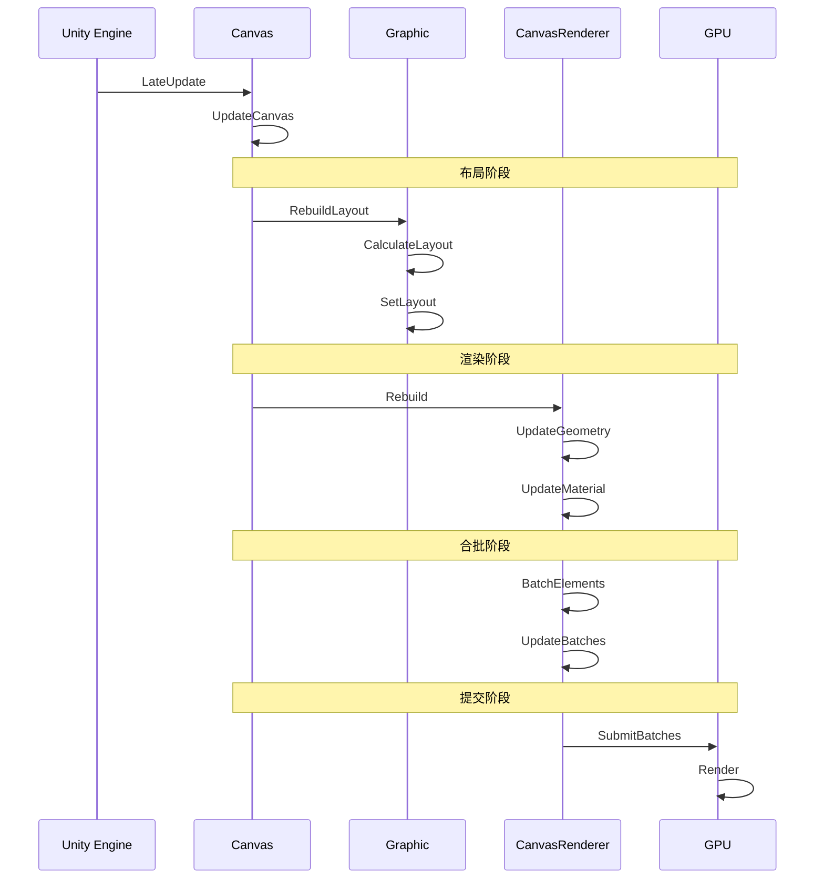
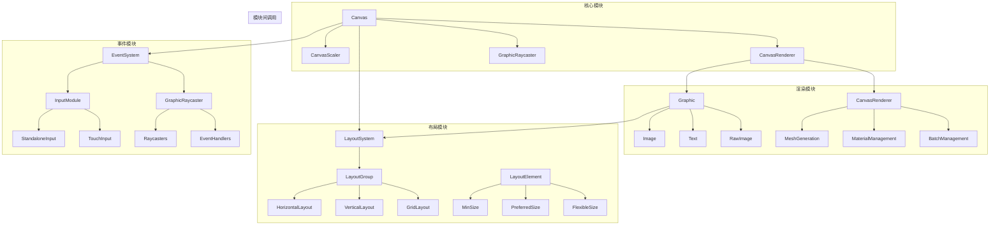
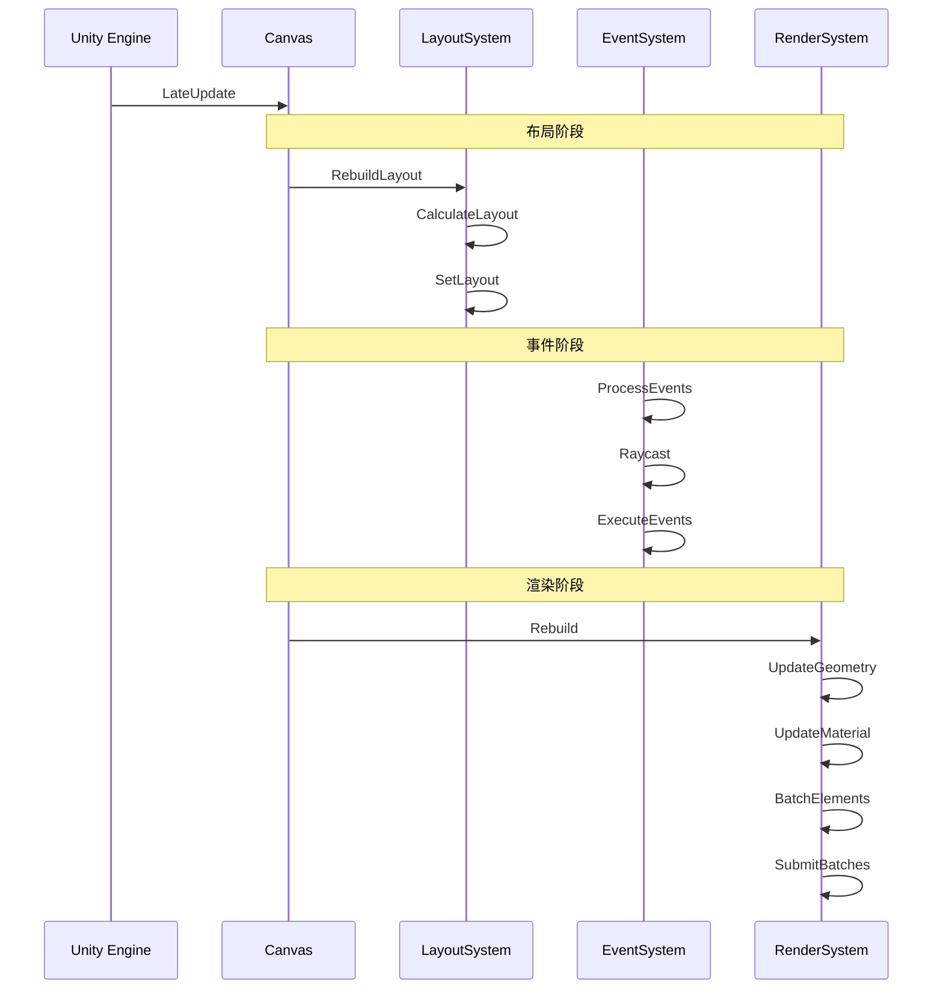

# UGUI 系统关系图

## 1. 事件系统详细架构

## 2. 布局系统详细架构

## 3. 渲染循环系统

## 4. 模块调用关系

## 5. 系统交互时序

## 6. 关键系统说明

### 6.1 事件系统
- **输入处理**：处理鼠标、键盘、触摸等输入
- **射线检测**：检测 UI 元素是否被点击
- **事件分发**：将事件分发给对应的 UI 元素
- **事件处理**：执行 UI 元素的响应函数

### 6.2 布局系统
- **布局计算**：计算 UI 元素的位置和大小
- **布局更新**：更新 UI 元素的布局
- **布局优化**：优化布局计算性能
- **布局约束**：处理布局约束条件

### 6.3 渲染循环
- **布局阶段**：计算 UI 元素的位置和大小
- **渲染阶段**：生成 UI 元素的网格和材质
- **合批阶段**：合并相同材质的 UI 元素
- **提交阶段**：将渲染数据提交给 GPU

### 6.4 模块调用
- **Canvas**：UI 系统的根节点
- **Graphic**：UI 元素的基类
- **Layout**：处理 UI 元素的布局
- **Event**：处理 UI 元素的交互
- **Renderer**：处理 UI 元素的渲染 